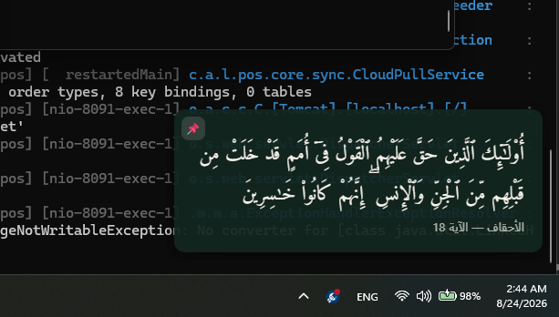
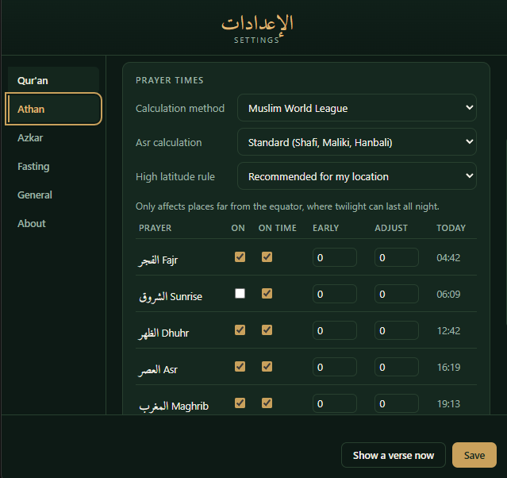
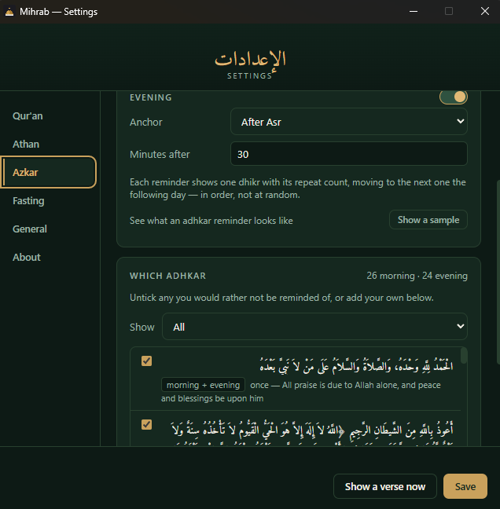
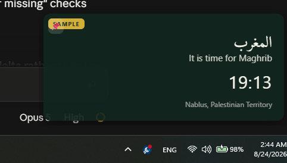

# Mihrab

A Windows tray app for Qur'an verses, prayer times, adhkar and fasting
reminders. Everything is calculated on your own machine — no accounts, no
servers, no telemetry.

**[⬇ Download the latest release](https://github.com/nizar-94/mihrab/releases/latest)**

<p align="center">
  
  <br>
  <em>A verse arriving while something else is compiling.</em>
</p>

---

## What it does

### Qur'an verses

- **Three scheduling modes** — every N minutes, at given minutes of each
  hour, or at specific daily times.
- **Random or sequential** order, remembering your place across restarts.
- **Khitmah progress** — in sequential order, a progress bar tracks your way
  through a complete reading, on the card and in Settings.
- **Twenty translations across sixteen languages**, shown beneath the
  Arabic. Downloaded only when you pick one; none is bundled.
- **Adjustable text size** for the Arabic on the card.
- Amiri Quran typeface, right-to-left, tashkeel intact, and the card sizes
  itself to the verse.

### Prayer times

- **Works anywhere** — choose from 34,000 bundled cities or enter
  coordinates directly. Nothing is sent anywhere.
- **Twelve calculation methods** — Muslim World League, Umm Al-Qura, ISNA,
  Egyptian, Karachi, Diyanet and more — plus Standard/Hanafi for Asr, so the
  times match whichever convention your local mosque follows.
- **Per prayer**: on or off, a reminder at the time, an early warning some
  minutes before, or both.
- **Fine adjustment** — shift any prayer by up to 59 minutes.
- **Correct at high latitudes**, where twilight never ends in summer or the
  sun does not set at all.

### Adhkar

- **34 morning and evening adhkar** in Arabic, with English translation,
  transliteration and repeat counts.
- **Anchored to prayer times, not the clock** — morning after Fajr or
  sunrise, evening after Asr or Maghrib, with an offset you choose. The
  reminder stays in its proper window as day length changes through the year.
- **Editable** — switch any off, or add your own.

### Fasting

- **White days** (13th, 14th, 15th of each Hijri month), **Mondays and
  Thursdays**, **Tasu'a and Ashura**, the **Day of Arafah**, and the **six
  days of Shawwal** — each independently toggleable.
- **Reminders arrive the day before**, at a time you set, so there is still
  time to prepare and to make suhoor.

### The app itself

- Lives in the tray; runs with no window open.
- Settings in **Arabic or English**, right-to-left when Arabic.
- Quiet hours, pause and resume, and a sample notification for each category.
- Starts with Windows, and updates itself from GitHub Releases.

---

## Screenshots

| | |
|---|---|
|  |  |
| **Prayer times** — method, Asr school, per-prayer control, and today's times in the last column | **Adhkar** — anchored to a prayer with an offset, and every dhikr individually switchable |

<p align="center">
  
  <br>
  <em>A prayer reminder. The badge marks it as one of the built-in samples —
  real ones look identical without it.</em>
</p>

---

## Install

Download `Mihrab-Setup-<version>.exe` from the
[latest release](https://github.com/nizar-94/mihrab/releases/latest) and run it.

Windows 10/11, 64-bit. It installs per-user, so there is no admin prompt,
and it adds a Start Menu entry rather than a desktop icon — the app lives in
the notification area, behind the `^` chevron next to the clock.

**You will see a SmartScreen warning** — *"Windows protected your PC"*.
Click **More info** → **Run anyway**. This is expected: the installer is not
code-signed yet, so Windows has no publisher identity to check it against.
Every unsigned installer gets this. See
[`docs/code-signing.md`](./docs/code-signing.md) for what is being done about
it — and the source is right here if you would rather read the code than
trust the binary.

On first launch it asks for your location once. That is the only thing the
app cannot work out for itself.

To uninstall: Settings → Apps → Installed apps → Mihrab.

---

## Privacy

Everything is computed locally. Prayer times come from your coordinates on
your own machine; the Qur'an text and the adhkar ship with the app.

The app makes exactly **two** kinds of network request, both visible in the
source:

1. **Update checks** against this repository's Releases feed.
2. **A translation download**, once, if you choose one.

No accounts, no analytics, no telemetry. Nothing about you leaves your
machine.

---

## Development

```bash
npm install
npm run dev    # run the app in development mode
npm test       # run the test suite
npm run dist   # build the Windows installer into dist/
```

Auto-update checks and autostart registration are inert in a dev run — both
are packaged-only, so running from source cannot alter your installed app's
settings.

Releases are cut by pushing a `v*` tag, which triggers
[`.github/workflows/release.yml`](.github/workflows/release.yml): tests,
build, publish.

### Gotcha: Electron binary not downloaded

On some setups `npm install` does not fetch the Electron binary. If
`npm run dev` fails to launch immediately, run:

```bash
node node_modules/electron/install.js
```

---

## Attribution

Full details and licence terms are in [`NOTICE`](./NOTICE).

- **Qur'an text** — [Tanzil Project](https://tanzil.net) (Uthmani, v1.1),
  CC-BY 3.0.
- **Amiri Quran font** — the [Amiri project](https://github.com/aliftype/amiri),
  SIL OFL 1.1.
- **Prayer times** — [adhan](https://github.com/batoulapps/adhan-js), MIT.
- **City coordinates** — [GeoNames](https://www.geonames.org), CC-BY 4.0.
- **Adhkar** — [Morning and Evening Adhkar Database](https://github.com/Seen-Arabic/Morning-And-Evening-Adhkar-DB),
  MIT. Each entry keeps its own hadith citation.
- **Translations** — [Tanzil](https://tanzil.net/trans/), **not bundled**:
  downloaded to your own machine when you choose one, because Tanzil provide
  them for non-commercial use only.

---

## Not yet

- Athan audio — prayer reminders use the standard notification chime.
- macOS and Linux builds.
- Code signing.

Roadmap: [`docs/future-phases.md`](./docs/future-phases.md).

---

## Contributing

Issues and pull requests are welcome — bugs, prayer times that look wrong
for your area, a calculation method that is missing, anything.

Contributors sign a **Contributor License Agreement** before code can be
merged; if you are opening your first pull request, say so and it will be
sorted out with you. See [`CONTRIBUTING.md`](./CONTRIBUTING.md).

---

## Licence

**GPL-3.0-or-later** — see [`LICENSE`](./LICENSE).

You are free to use, study, share and modify this software. If you
distribute a modified version, you must release your source under the GPL
too, so it stays free for everyone downstream.

The bundled Qur'an text, font, city data and adhkar carry their own
licences — see [`NOTICE`](./NOTICE).

---

## Author

Built by **Nizar Hawawreh** —
[GitHub](https://github.com/nizar-94) ·
[LinkedIn](https://www.linkedin.com/in/nizar-hawawreh/)

Copyright © Nizar Hawawreh.
